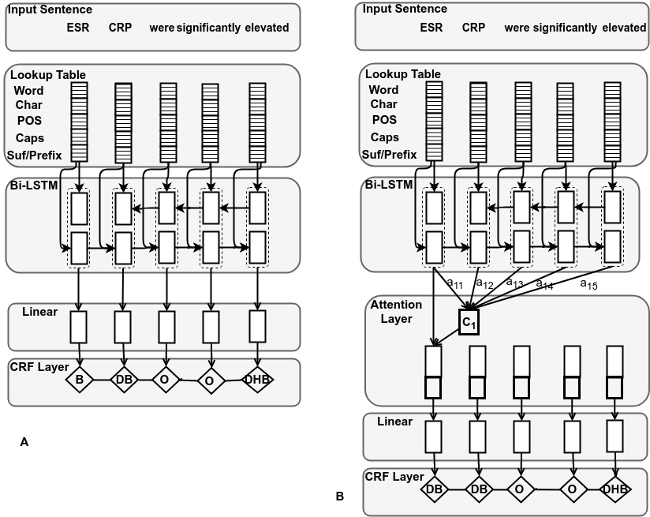

# Biomedical Named Entity Recognition

**BMNER_pytorch repository** is a deep learning implementation of Biomedical Named Entity Recognition. The implementation includes Bi-directional LSTM with attention layer using Pytorch library.

 

## Source:

* **code folder:** contains the implementation of neural network and supporting files in python programming language.
  * **`train_bilstm.py`**: Main class to run Bi-LSTM. 
  * **`train_bilstm_attn_adversarial.py`**: Main class to run Bi-LSTM with attention. 
  * **`model.py`**: contains the neural network architecture of Bi-LSTM. 
  * **`model_attn_adversarial.py`**: contains the neural network architecture of Bi-LSTM with attention layer and adversarial training.
  * **`loader.py`**: loads the input sentences and their respective tags.
  * **`utils.py`**: contains the functions used for preprocessing step.


## Runnable Scripts:

* `commandline_scripts`: folder contains the scripts with different settings to run python files.

Here is a script to train the attention based bidirectional LSTM model:
```
python train_bilstm_attn_adversarial.py 
  -T 'train/train_all.features' 
  -d 'train/dev_all.features' 
  -t 'test/test.features' 
  --test_crfFeatures_dir 'test/features' 
  --output_crfFeatures_dir test/features_OP/pytorch_$1.features  
  --clef_eval_script 'commandline_scripts/apr132018_bilstm_newattn_adversarial.eval.sh' 
  --pre_emb 'deepnlclef_glove_train_test_Vectors_vocab_vectors' 
  --pretrained_embedding_size 50 
  --lstm_output_size 100 
  --lr 0.001 
  --nb_epoch 150 
```
where,
* `-T`: Train directory containing feature files. Feature files contain words and part-of-speech features in the conll format.
* `-d`: Dev directory containing feature files
* `-t`: Test directory containing feature files
* `--output_crfFeatures_dir`: Directory to store predictions in output files
* `--clef_eval_script`: Script to evaluate the model predictions
* `--pre_emb`: Pretrained embeddings
* `--pretrained_embedding_size`: Pretrained embedding size
* `Hyperparameters`:
   *  `--lstm_output_size`: LSTM output dimension size
   *  `--lr`: Learning rate
   *  `--nb_epoch`: number of training epochs
